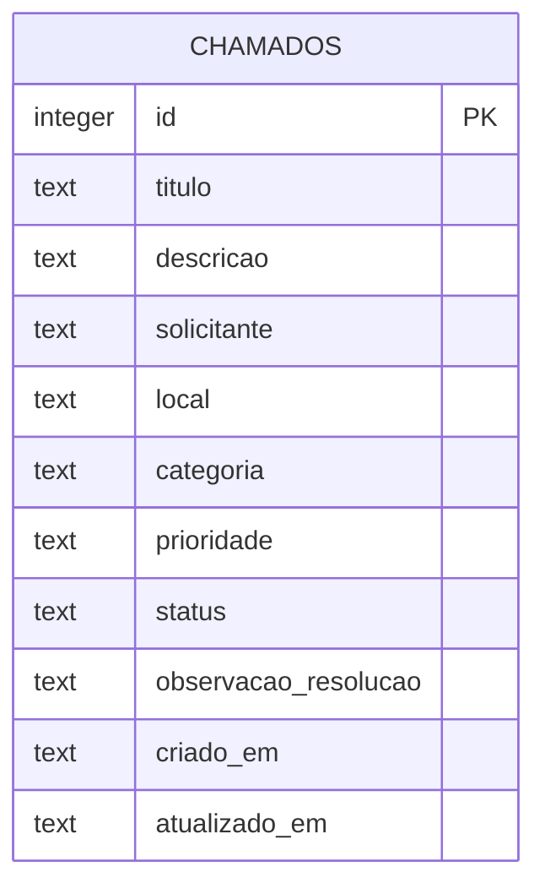

# Modelagem de dados do Manutenção Fácil

## Entidade principal

O MVP utiliza a entidade `chamados`, responsável por representar todo o ciclo inicial de uma solicitação de manutenção.

## Dicionário de dados

| Campo | Tipo | Obrigatório | Descrição |
|---|---|---:|---|
| id | inteiro | sim | Identificador único e incremental |
| titulo | texto | sim | Resumo do problema |
| descricao | texto | sim | Detalhes observados pelo solicitante |
| solicitante | texto | sim | Pessoa que registrou o chamado |
| local | texto | sim | Bloco, sala, setor ou outro ponto de referência |
| categoria | texto | sim | Elétrica, hidráulica, climatização, estrutura ou outros |
| prioridade | texto | sim | Baixa, média ou alta |
| status | texto | sim | Aberto, em atendimento ou concluído |
| observacao_resolucao | texto | sim | Registro opcional da solução aplicada; vazio inicialmente |
| criado_em | data e hora | sim | Momento do cadastro |
| atualizado_em | data e hora | sim | Momento da última alteração |

## Índices

- `idx_chamados_status`: acelera a consulta dos chamados por situação.
- `idx_chamados_criado_em`: auxilia a ordenação pelos registros mais recentes.

## Evolução prevista

Após os testes, o modelo poderá receber entidades separadas para usuários, técnicos, histórico de mudanças e evidências anexadas.

